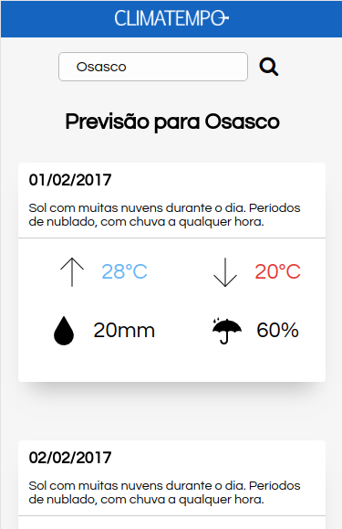
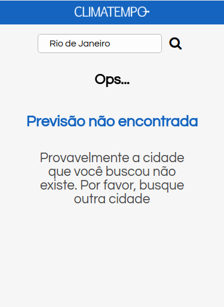
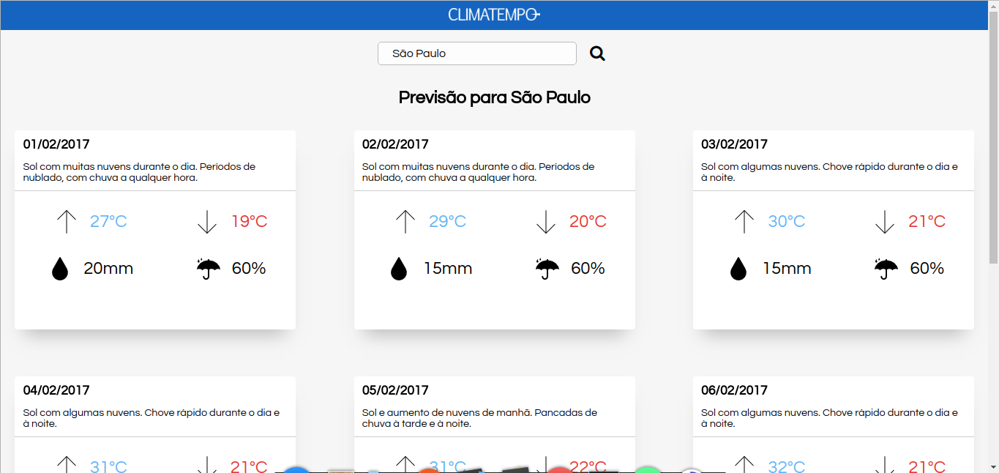

# Challenge Accepted
Aplicação web responsiva para consulta de previsão do tempo para uma semana nas cidades de Osasco e São Paulo.

# Arquitetura
O projeto foi dividido em 2 partes distintas.
- **Rest API** - Api Rest desenvolvida em **PHP** e **Slim Framework** para realizar as consultas e retornar os dados de previsão.
- **Site** - *Single Page Application* (SPA) desenvolvida em **React** para interação do usuário e visualiação dos dados.

# Configuração e Instalação
## Rest API
A API se encontra no diretório **challenge-accepted/api/**.
- ### Requisitos
    - PHP >= 7.2
    - [Composer](https://getcomposer.org/download/)

- ### Ferramentas
  - [Slim Framework 3](http://www.slimframework.com/docs/)
  - [PHP-DI](http://php-di.org/doc/frameworks/slim.html)
  - [Cors-Middleware](https://github.com/tuupola/cors-middleware)
  
- ### Instalação
    ```
    $ git clone git@github.com:LucasMallmann/challenge-accepted.git
    $ cd challenge-accepted/api/
    $ composer install
    ```
- ### Execução
  Dentro do diretório `api`, execute o comando: `php -S localhost:8888 -t public/index.php`

- ### Testes
  Para executar os testes, dentro do diretório `api` execute `./vendor/bin/phpunit --bootstrap vendor/autoload.php tests/WeatherLocaleApiTest.php`

## Site
O site se encontra no diretório **challenge-accepted/site/**
- ### Requisitos
  - [Node]((https://nodejs.org/en/download/)) > = 8.0
- ### Instalação
    ```
    $ git clone git@github.com:LucasMallmann/challenge-accepted.git
    $ cd challenge-accepted/site/
    $ npm install
    ```
- ### Ferramentas
  - [React](https://reactjs.org/)
  - [CSS Modules](https://github.com/css-modules/css-modules)
  - [Sass](https://sass-lang.com/)
  - [Axios](https://github.com/axios/axios)
- ### Execução
  Dentro do diretório `site`, execute o comando `npm start`. Isso irá executar a aplicação no modo de desenvolvimento.
  Para visualizar, acesse: `http://localhost:3000`
- ### **Observação**
  No arquivo `site/src/axiosInstance.js`, **definir a constante `baseUrl`** com a url em que está rodando o **servidor da API Rest.**

# Documentação
## API
- Arquivos de configuração no diretório `api/src/config`
  - `routes.php` - Configuração das rotas da API
  - `settings.php` - Configurações gerais da aplicação. Aqui estão as configurações das dependências, para aplicar o conteito de injeção de dependência.
  - `src/Challenge/Controllers` - Controllers da aplicação. São resposáveis por lidar com as requisições Http feitas à API.
  - `src/Challenge/Repository` - Design Pattern Repository aplicado para manipular os dados da aplicação.
    - `ILocaleRepository.php` e `IWeatherRepository.php` - *Interfaces* para abstrair a implementação da fonte de dados, para que a troca da fonte de consulta de dados seja mais fácil no futuro.
    - `Json/` - Implementação do *Repository* com a fonte de consulta de dados em Json

  - `src/Challenge/Services` - Serviço de previsão de tempo para as cidades de São Paulo e Osasco (SP).

  ### **Api Methods**
   | Method | Endpoint                       | Parameters       | Description                                                                                                                                          |
   | ------ | ------------------------------ | ---------------- | ---------------------------------------------------------------------------------------------------------------------------------------------------- |
   | `GET`  | */api/locale/:name*            | *name:* `string` | Consulta os locais com nome da cidade similar ao que foi passado como parâmetro. Se não for passado nenhuma cidade, todas as cidades são retornadas. |
   | `GET`  | */api/locale/:cityId/forecast* | *cityId:* `int`  | Busca a previsão do tempo de uma semana para uma determinada região.                                                                                 |

## Site
- `src/components` - Componentes de interface reutilizáveis através da aplicação.
- `src/containers` - Páginas principais da aplicação. Responsável pelas requisições Http e acessar a API. Irá renderizar os `components`, mas não possui implementação componentes de interface.
- `helpers` - Classes utilitárias conversão de valores, ou coisas mais genéricas durante a aplicação.

# Sample
## Mobile
### Home com a previsão

### Página para quando nenhuma cidade for encontrada

## Desktop
