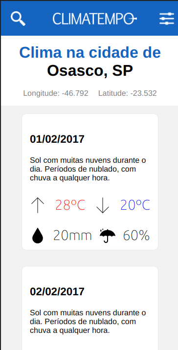

  

<!-- PROJECT LOGO -->
 

    <h3 align="center">Climatempo FrontEnd Challenge</h3>

  

    Este é um desafio para a vaga FrontEnd para o cliente Climatempo
     
    <a href="https://github.com/climatempo/challenge-accepted">Aqui está o desafio original</a>
     
    <a href="https://github.com/phfdonda/challenge-accepted/pulls">Reporte algum Bug</a>
    ·
    <a href="https://github.com/phfdonda/challenge-accepted/request_feature">Se quiser uma feature</a>
  

---

# Desafio Front-End - Pedro Donda

> Este site é resultado de um desafio para a vaga FrontEnd da contratadora Hypesoft, para o cliente Climatempo.

## Live Version

Se quiser ver a versão em tempo real, aqui está o link:
[Live Version](https://getninjas-challenge.herokuapp.com/)

This is an app deployed in Heroku, so please wait up to 30 seconds for it to load the first time.

### Screenshots of the project

The original form of GetNinjas looks like this:

The initial page looks like this:

<!-- TABLE OF CONTENTS -->

## Table of Contents

- [About the Project](#about-the-project)
  - [Restrictions](#restrictions)
  - [Objectives](#objectives)
  - [Installation](#installation)
  - [Instructions](#instructions)
  - [Built With](#built-with)
  - [Testing](#testing)
- [Contact](#contact)
- [Acknowledgements](#acknowledgements)

<!-- ABOUT THE PROJECT -->

## About The Project

This is a challenge requested as part of a hiring process.

### Restrictions

1. I am allowed to use:

- ES6 Javascript
- Linters, both for JS as well as for CSS
- Task runners/builders such as Webpack, Gulp, Grunt and such.

2. I am NOT allowed to use:

- JS Frameworks - React, Angular, Vue, you name it.
- Utility libraries - Underscore, Lodash, etc.
- CSS Frameworks - Bootstrap, Less, MaterializeCSS, and so on.

3. I AM allowed to use SCSS or SASS, but I have to give a good explanation about the real necessity of it.
4. Test frameworks are allowed.

### Objectives

1. The objective of this test is to evaluate the code's:

- organization;
- semantic;
- full use of features of HTML, CSS and Vanilla JavaScript;
- pattern usage;
- code performance;
- JavaScript testing.

2. I must create a server using Node.js to serve the fields.json file that is in the root folder as an API. I AM allowed to use Express.
3. I don't have to copy the whole [given page](https://www.getninjas.com.br/moda-e-beleza/cabeleireiros), only the request form. The fields must be dynamically assembled acording to the content of the fields.json file.
4. Every form field that has the `required: true` must show a warning message if the user tries to go forward without filling it. The message should be "Este campo é requerido".
5. All fields with type "enumerable" are to be of type `select`. This is basically every one, except for one textarea and four input fields at the end.
6. The form does not need to make a POST request.
7. GetNinjas have a culture of unit and integration testing. One of these two forms of testing is mandatory.
8. I can create a route for the HTML form.

## Installation

Node.js and npm (Node Package Manager) are needed to run this project. Follow these steps to install it:
[Node - Installation Guide](https://docs.npmjs.com/downloading-and-installing-node-js-and-npm)

You can download the [repo](https://github.com/phfdonda/frontend-challenge/archive/master.zip) or clone (paste on the terminal) `git@github.com:phfdonda/frontend-challenge.git` using SSH or `https://github.com/phfdonda/frontend-challenge.git` using HTTPS.

Open the terminal and cd to the path where you download the project. It should be something like: `User/<folder>/frontend-challenge/`. After that, run `npm install` to install all dependencies.

If you're using yarn and encounter a problem with yarn packages, run `yarn install --check-files`.

This project didn't require a database set-up, so it is pretty much simple. By default the port is set to 3000. Run in your terminal `npm start`. In your browser url bar, type `localhost:3000`.

Enjoy!!

### Built With

- Pug for HTML
- Vanilla Javascript
- Pure CSS (no pre-processors)
- Express
- VsCode
- Nightwatch for testing.
- Stickler for linting.

## Testing

For testing I used the package `Nightwatch` for integration testing.

For the test to work the server must be online. For you to run tests on the project yourself, cd into the project root folder and run `npm start`. In another terminal window, run `npm test`.

I didn't have time enough to do a thorough battery of tests, but I hope the amount here is enough to show some of my knowledge about integration testing.

<!-- CONTACT -->

## Contact

Pedro Henrique Ferreira Donda

Github - [@phfhdonda](https://github.com/phfdonda)

LinkedIn - [PedroDonda](https://www.linkedin.com/in/pedro-donda-808621bb/)

<!-- ACKNOWLEDGEMENTS -->

## Acknowledgements

- [GetNinjas](https://www.getninjas.com.br/)
