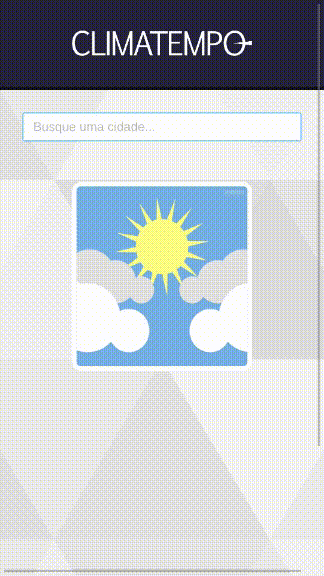

## Guia Rápido

Para execultar este APP e API você precisa ter configurado:

- [NodeJS](http://nodejs.org/)
- [Yarn](https://yarnpkg.com/lang/en/docs/cli/install/)

A aplicação foi desenvolvida com NodeJS no Backend e React no Frontend.

```bash
# Clone o repositório do projeto
$ git clone https://github.com/adeiltonsousa/challenge-accepted

## STARTANDO A API

# Vá para o diretório da API
$ cd api

# Agora instale todas as dependências
$ yarn install

# Starte o projeto
$ yarn start

# O server da API estará em localhost na porta 3001

## STARTANDO O FRON-END REACT

# Vá para o diretório do APP
$ cd app

# Agora instale todas as dependências
$ yarn install

# Starte o projeto
$ yarn start

# O APP estará disponível em localhost na porta 3000

```

## Tecnologias

**Frontend:**

- [React](https://reactjs.org/)
- [Axios](https://github.com/axios/axios)
- [Styled Components](https://styled-components.com/)
- [Ant Design](https://ant.design/)

No React, utilizei o ContextAPI para fazer o controle de estado dos dados da aplicação. Para a construção da interface utilizei o recurso da Lib Styled-Component, que permite organizar os arquivos de estilo e traz maior produtividade. Para construir a aplicação de modo a ficar responsiva, utilizei o FlexBox do CSS. Adicionei também o Ant Design para utilizar recurso de filtro nos Inputs. Para consumir os dados da API, utilizei o Axios que oferece um maior controle nas consultas.

**Backend:**

Para simular as operações de busca nos arquivos JSON disponibilizados, utilizei o LowDB que permite ler e escrever em um JSON local. Para o sistema de rotas dentro do Node utilizei o Express.

- [Node.js](https://nodejs.org/en/)
- [LowDB](https://github.com/typicode/lowdb)
- [Express](https://expressjs.com/pt-br/)

## Screenshots

### Browser App

<p align="center">
	

</p>

### Mobile App

<p align="center">
    
    
</p>

© Adeilton Sousa
