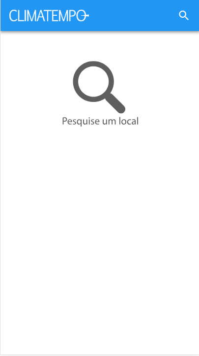
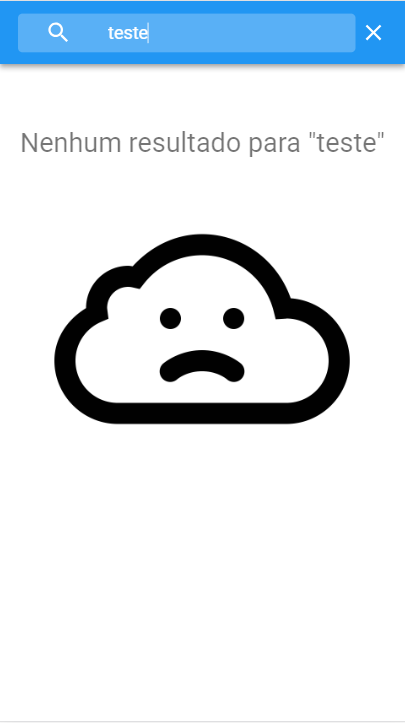
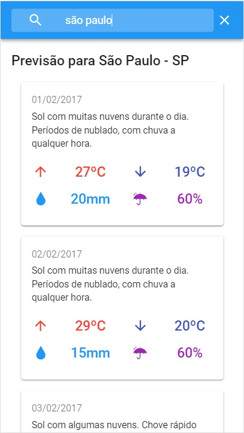
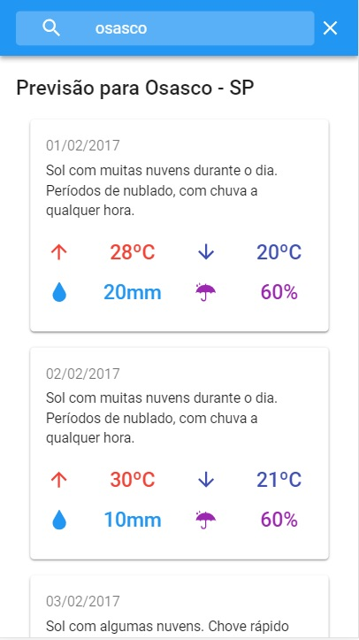

# Desafio Climatempo

Dependências:

- node.js
- npm ou yarn

## Back-end

O servidor é uma API REST feita com **Express.js**, utilizando como base de dados os arquivos em json fornecidos.

### Executar Back-end

```
    cd backend
    npm start
```

ou

```
    cd backend
    yarn start
```

Por padrão o servidor vai rodar em: `http://localhost:5000/`

### Executar testes

```
    cd backend
    npm test
```

ou

```
    cd backend
    yarn test
```

### Rotas

`BASEURL = http://localhost:5000/`

| rota                        | requisição | query                | retorno                          |
| --------------------------- | ---------- | -------------------- | -------------------------------- |
| BASEURL                     | GET        | -                    | Versão da API                    |
| BASEURL/api/v1/locale?:name | GET        | name - nome do local | JSON com dados do local          |
| BASEURL/api/v1/weather?:id  | GET        | id - id do local     | JSON com dados do clima do local |

## Cliente

Aplicação em **React** utilizando a biblioteca **Material-UI**.

### Executar Cliente

```
    cd client
    npm start
```

ou

```
    cd client
    yarn start
```

Por padrão o servidor vai rodar em: `http://localhost:3000/`

## Interface

|                          |                                |
| ------------------------ | ------------------------------ |
|  |  |  |  |

|                              |                                  |
| ---------------------------- | -------------------------------- |
|  |  |
