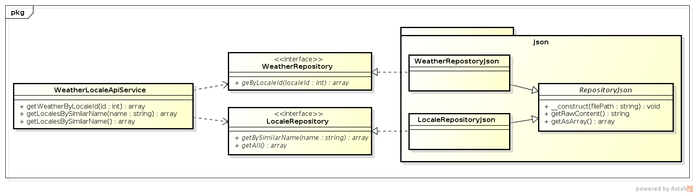
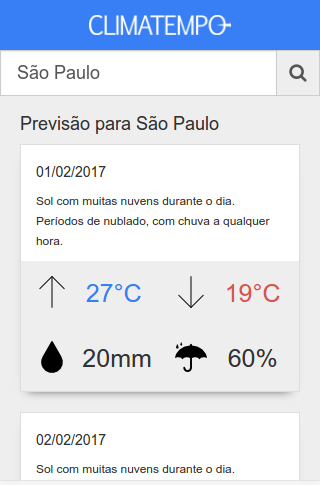

# Challenge Accepted

Aplicação web responsiva para permitir consulta de previsão do tempo nos próximos dias em Osasco e São Paulo.

- [Configuração e Instalação](#configuração-e-instalação)
- [Documentação](#documentação)

----

# Configuração e Instalação

  - ### Requisitos
    - PHP >= 5.6
    - Adicionar PHP na linha de comando
    - [Composer](https://getcomposer.org/download/)
    - [Adicionar Composer na linha de comando](https://getcomposer.org/doc/00-intro.md#globally)

  - ### Instalação
    ```
    $ git clone git@github.com:deoliveiralucas/challenge-accepted.git
    $ cd challenge-accepted
    $ composer install
    ```
  
  - ### Executar em **desenvolvimento**
    - `php -S localhost:8000 -t public`
    - Acesse: http://localhost:8000

  - ### Executar em **produção**
    - Adicionar variável de ambiente `PRODUCTION` com valor `true` para desabilitar o debug de erros
    - Adicionar a pasta `public` como **Document Root**
    - [Configurar front-controller no Web Server](https://www.slimframework.com/docs/start/web-servers.html)

  - ### Executar testes
    ```
    $ composer test
    // or
    $ php vendor/phpunit/phpunit
    ```
    
---

# Documentação

  - ### História de usuário

    > Quero saber como vai ficar o tempo para os próximos dias em Osasco e São Paulo utilizando meu smartphone.
    
  - ### Requisitos funcionais
    - Consultar localidade pelo nome.
    - Consultar todas as localidades.
    - Consultar previsão do tempo para um determindo local.
    
  - ### Requisitos não funcionais
    - Uso de design responsivo nas interfaces gráficas.
    - Utilização do estilo de código PSR-2.
    - Utilização design patterns e de princios boas práticas para deixar o sistema mais coeso e desacoplado.
    - Uso de testes unitários/funcional.
    
  - ### Ferramentas e motivação
    - **Slim**: Por ser uma aplicação muito pequena foi escolhido como melhor opção no momento.
    - **jQuery**: Requisições simples em Ajax para consumo da API, caso a aplicação tenda a crescer, o ideal seja migrar para uma biblioteca SPA (AngularJS, React, Vue, etc).
    - **Bootstrap**: Devido ao curto prazo foi escolhido pelo ganho de produtividade e facilidade de deixar a aplicação responsiva.
  
  - ### Arquitetura
    - Arquivos de configuração no diretório `config`:
      - `routes.php` configuração das rotas;
      - `settings.php` configurações gerais da aplicação;
      - `dependencies.php` configurações das dependências utilizando [Pimple](http://pimple.sensiolabs.org/).
    - Utilização de *iterfaces* para criação dos *repositories* com o objetivo de facilitar a implementação de uma nova fonte de consulta dos dados.
    - Diagrama de classe: 
    
    
    
  - ### API
  
    | Method | Endpoint | Parameters | Description |
    | ------ | ------ | ------ | ------ |
    | `GET` | */api/locale/similarname/:name* | *name:* `string` | Consulta todos os locais com o nome similar ao que foi passado por parâmetro; caso nada seja passado, retorna todos. |
    | `GET` | */api/locale/:id/weather* | *id:* `int` | Consulta a previsão do tempo dos próximos dias para um local especifico. |

  - ### Cobertura de testes
  
    - Summary:                
      - Classes: 25.00% (1/4)  
      - Methods: 55.56% (5/9)  
      - Lines:   91.67% (44/48)
    
    - Tests
    
      ```
      Functional\ChallengeAccepted\Homepage
	   [x] Access home should work and contain the title
		
      Functional\ChallengeAccepted\Service\WeatherLocaleApiService
       [x] Get weather by locale id should work
       [x] Get locale by similar name should work
		
      Unit\ChallengeAccepted\Service\WeatherLocaleApiService
       [x] Get weather by locale id should work
       [x] Get weather by locale id should return status code 400
       [x] Get weather by locale id should return status code 500
       [x] Get locales by similar name should work
       [x] Get locales by similar name should return status code 400
       [x] Get locales by similar name should return status code 500
      ```
 
  - ### Todo
    - [ ] Manter cobertura de testes maior que 90%

  - ## Interface gráfica do usuário
    - Página principal após selecionar uma localidade
    
    
	

  - ### Desenvolvedor
    - Lucas de Oliveira - [@deoliveiralucas]()
