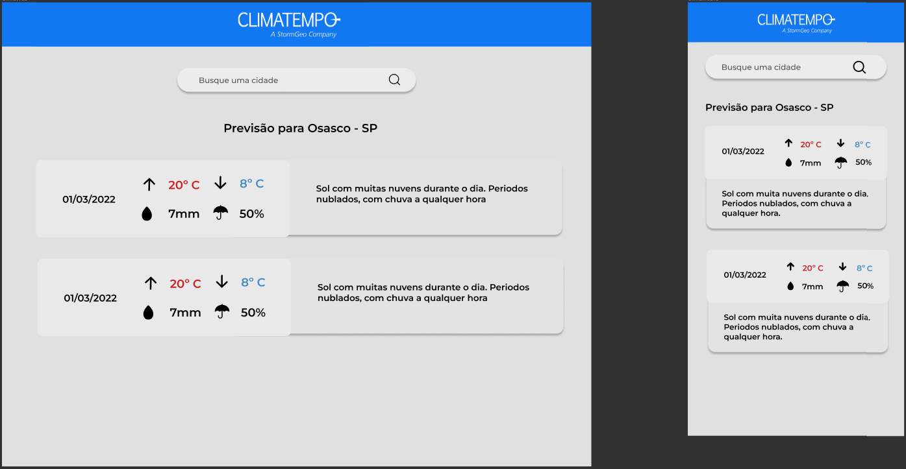

# ClimaTempo challenge-accepted
## Frontend
### O que foi feito

Primeiro foi criado um prototype no **figma** de como seria estruturada as telas:

Depois foram criados os seguintes componentes: 

- Header: foi criado um cabeçalho com a logo da Clima. 

- Search: foi criado um input autocomplete para pesquisa das localidades, ele utiliza a `API` do backend para buscar as localidades.

- NameCity: foi criado um componente para identificar a localidade selecionada.

- Card: foi criado um componente para mostrar os dados meteorologicos da localidade que são fornecidos pela `API` do backend.

### Como rodar?

Para rodar a aplicação siga os passos abaixo: 

- Entre na pasta do projeto: `cd frontend` 

- Instale as dependências: `npm install`

- Inicie a aplicação: `npm start`

## Backend
### O que foi feito
O backend tem duas rotas que podem ser utilizadas que são elas:

- `/locales?filter=<string>`: rota tipo `GET` que retorna todas as localidades. Essa rota permite um parametro opcional na url chamado `filter`, que filtra as localidades que contenham o texto informado no seu nome.

- `/forecast?id=<number>&cityName=<string>&temperatureUnit=<string>&precipitationUnit=<string>`: rota tipo `GET` que retorna os dados meteorológicos da cidade selecionada pelo `id` ou pelo `cityName`. Caso o id e cityName não sejam informados ou não haja previsão para a cidade representada, um erro será retornado. **Parte do desafio extra:** obrigatoriamente é necessário passar a unidade de temperatura e precipitação para mundança de "mm" para "inch", "C" para "F" e vice-versa.

### Como rodar?

Para rodar a aplicação siga os passos abaixo:

- Entre na pasta do projeto: `cd backend`

- Instale as dependências: `npm install`

- Inicie a aplicação: `npm start`
