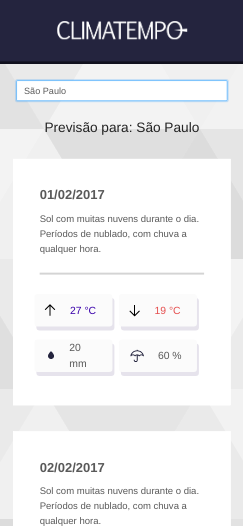

## Guia Rápido

Para execultar este APP e API você precisa ter configurado:

- [NodeJS](http://nodejs.org/)
- [Yarn](https://yarnpkg.com/lang/en/docs/cli/install/)

```bash
# Clone o repositório do projeto
$ git clone https://github.com/adeiltonsousa/challenge-accepted

## STARTANDO A API

# Vá para o diretório da API
$ cd api

# Agora instale todas as dependências
$ yarn install

# Starte o projeto
$ yarn start

# O server da API estará em localhost na porta 3001

## STARTANDO O FRON-END REACT

# Vá para o diretório do APP
$ cd app

# Agora instale todas as dependências
$ yarn install

# Starte o projeto
$ yarn start

# O APP estará em localhost na porta 3000

#
```

## Tecnologias

**Frontend:**

- [React](https://reactjs.org/)
- [Axios](https://github.com/axios/axios)
- [Styled Components](https://styled-components.com/)
- [Ant Design](https://ant.design/)

**Backend:**

- [LowDB](https://github.com/typicode/lowdb)
- [Node.js](https://nodejs.org/en/)

## Screenshots

### Browser App

<p align="center">
	

</p>

### Mobile App

<p align="center">
  

</p>

© Adeilton Sousa
