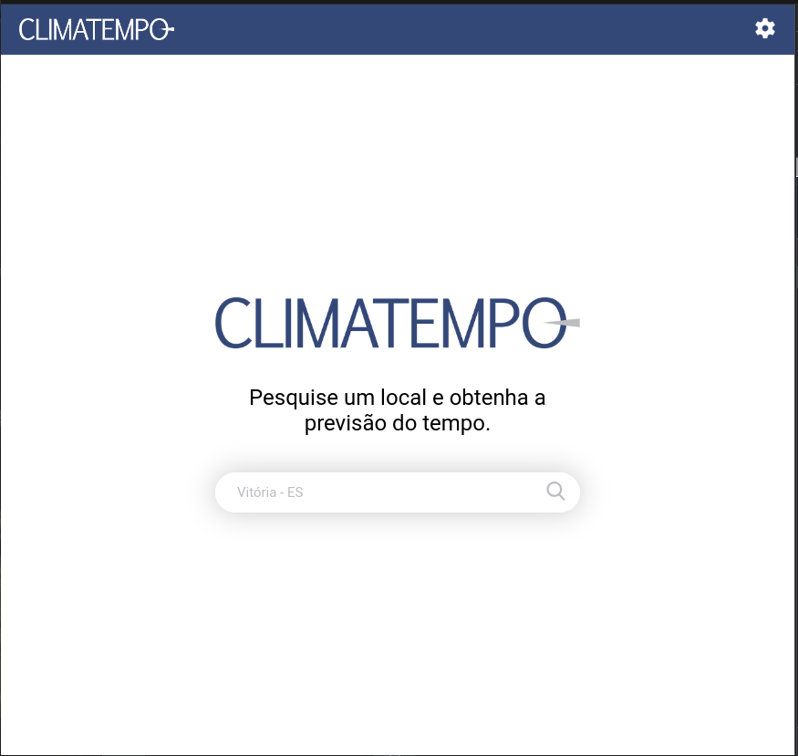
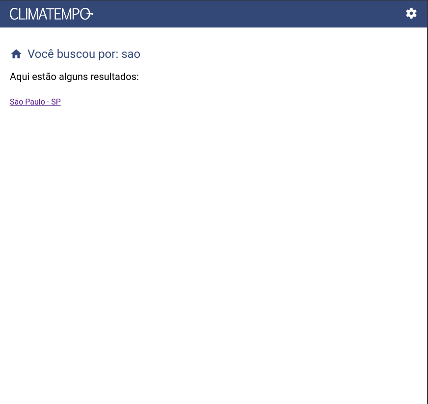
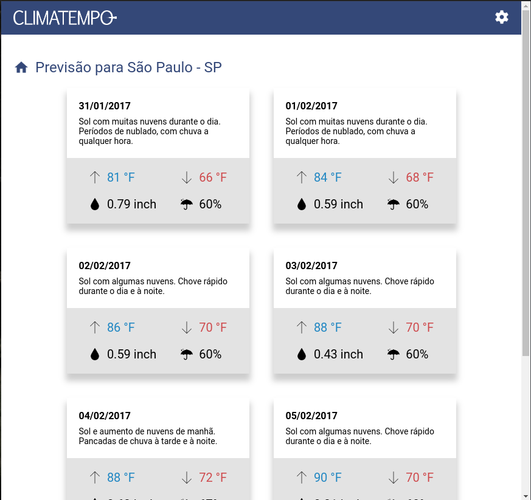
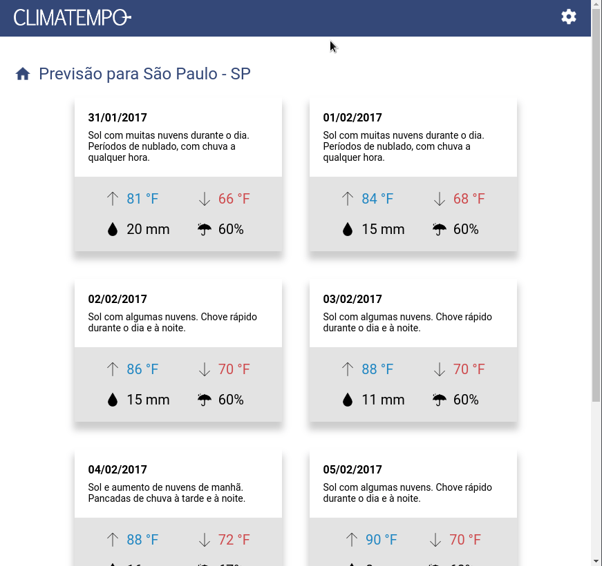

# Challenge Accepted

Home:



Pesquisa:



Previsão:



Configuração do usuário:



### **Rodando localmente**

**Docker:**

Para rodar localmente via Docker, basta executar o seguinte comando na raíz do repositório:

```bash
docker-compose up
```
ou
```bash
docker compose up
```

O front já deve está sendo executado em http://localhost:5173 e consumindo o backend normalmente.

**Sem o Docker:**

Para rodar localmente sem o Docker, será necessário o Node 18.12.0 (lts/hydrogen), caso tenha o NVM, execute os seguintes comandos a partir da raíz do repositório:

```bash
nvm install
```
```bash
nvm use
```

Se você está com o Node 18.12.0 ou executou os comandos anteriores, você também deve executar os seguintes comandos:

```bash
cd back && yarn && yarn serve
```
```bash
cd front && yarn && yarn dev
```

O front já deve está sendo executado em http://localhost:5173 e consumindo o backend normalmente.

### **Deploys feitos:**

| Aplicação | URL |
| --------------------- | ------------- |
| Front | https://climatempo-challenge-eta.vercel.app |
| Back | https://climatempo-challenge-back.herokuapp.com |

