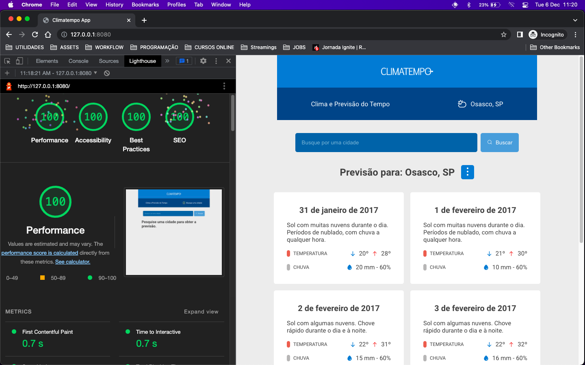

# Desafio Climatempo

Essa aplicação está divida em dois subsistemas:

-  `API` sendo o backend da aplicação que trata as requisições da API e disponibiliza os dados
-  `WEB` sendo o frontend que o usuário interage e que faz as requisição dos dados para a API

## Sobre o projeto

Web App que exibe dados de previsão do tempo por cidade pesquisada, consumindo os dados através de API RESTful.



-  Análise Lighthouse: 100% Performace | 100% Acessibilidade | 100% Boas práticas | 100% SEO

-  [Protótipo da interface](https://www.figma.com/file/t9fJqD8uh0yuXEeHvKsgm1/Layout---Climatempo-app?node-id=0%3A1&t=KzGQzecOwTi9SJlK-1) no Figma.

-  [Documentação da API](https://documenter.getpostman.com/view/14419670/2s8YzMXQhT) no Postman.

-  Docker imagens: `tayhsn/climateapp` e `tayhsn/climateapi`

#### Funcionalidades

-  Responsividade Mobile, Tablet e Desktop
-  Tratamento de erro caso não obtenha os dados da cidade pesquisada
-  O usuário pode escolher visualizar a temperatura em Celsius ou Fahrenheit (padrão é Celsius) e a precipitação da chuva em Milímetros ou Polegadas (padrão é Milímetros)

#### Melhorias futuras

-  Persistir os dados no MongoDB
-  Implementar ElasticSearch para autocompletar a pesquisa
-  Adicionar API GraphQL
-  Implementar testes unitários

#### Tecnologias utilizadas

-  Typescript
-  Node.js, Express.js, Cors
-  React.js, Styled-components, RadixUI, Phosphor-react, Zod, React-hook-form, Axios

## Rodando a aplicação

Primeiro, instalamos as dependências do backend e iniciamos o servidor da API

```bash
cd api/ # entra na pasta api

npm install && npm run dev # instala as depedências e inicia o servidor do backend
```

Depois, instalamos as dependências do frontend, fazemos o build e servimos a página estática via http-server

```bash
cd .. && cd web/ # volta uma pasta e entra na pasta web

npm install # instala as depedências

npm run build # transforma a aplicação em uma página estática

cd dist && npx http-server # serve a página estática via http
```
