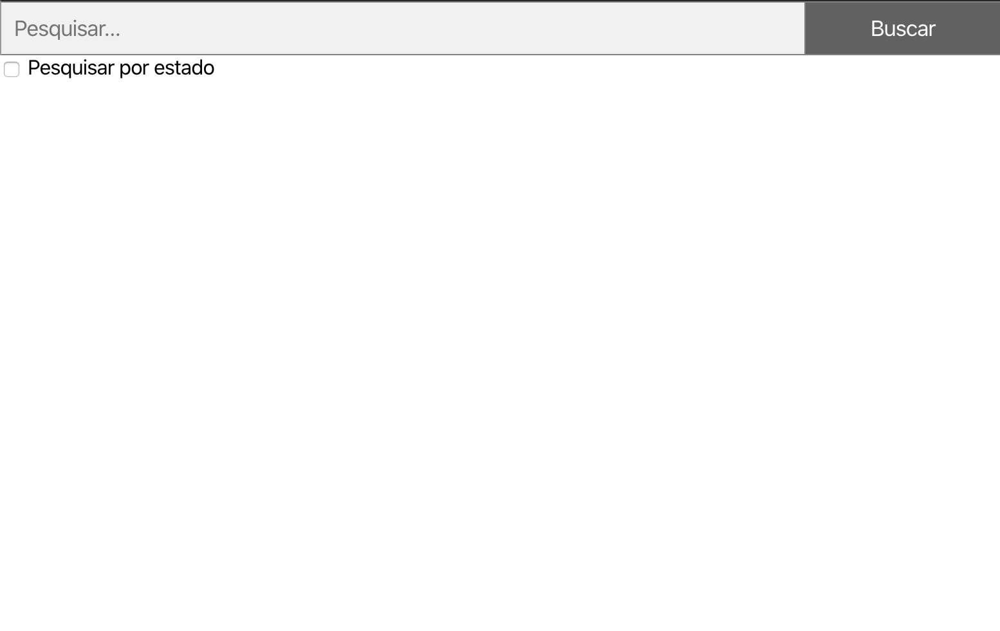
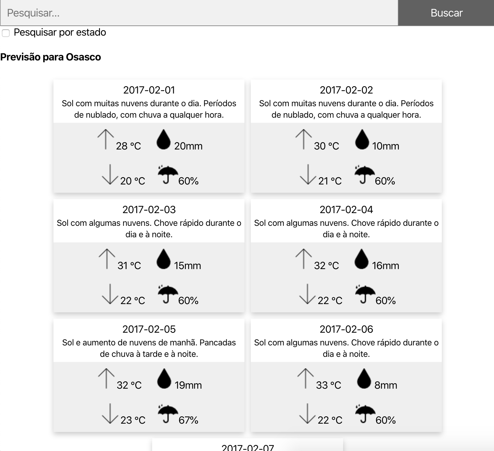

# Climatempo challenge

### Considerações

Escrevi o backend utilizando JavaScript ES6 no NodeJS environment. O front-end não é meu forte pois sou back-end a muitos anos, mas está escrito em React. Estou utilizando apenas um componente pois é bem simples este front-end.

Optei por uma arquitetura mais limpa visto que são pouquíssimos endpoints.

### Como rodar a aplicação

Primeiramente é preciso ter o **Docker** instalado para que lhe seja permitido utilizar **docker-compose**.

Pois, basta acessar o diretório do projeto é executar:
```
docker-compose up --build
```

Este comando irá configurar os containers que também são bem simples e nem precisei criar bundles para isso. Espere até que veja a seguinte mensagem:

```
front_1  | INFO: Accepting connections at http://localhost:3000
api_1    | Listening on port: 3030.
```
Lembrando, é preciso ter a porta 3000 e 3030 livres.

Sendo assim, basta acessar pelo seu navegador o endereço **http://localhost:3000** para ter acesso a aplicação.

Para parar a aplicação, apenas execute:
```
docker-compose stop
```

### Como funciona?

Como havia dito, o front é bem simples pois meu forte é back-end de alta demanda.

- Para buscar todas as cidades apenas faça uma pesquisa sem fornecer nenhum dado.
- Para buscar cidades pelo nome. ex: Osasco, basta escrever o nome da cidade exatamente como no json.
- Para buscar cidades por estado, basta digitar a sigla do estado em letra maiúscula, como por ex: SP e marcar o checkbox abaixo da busca.

Ao buscar as cidades aparerão pequenos cards contendo o nome da cidade e o estado. Para visualizar os cards referentes a previsão do tempo, basta clicar em qualquer uma das cidades e todos os cards aparecerão.






### Testes
Os testes podem ser executados no host, apenas executando
```
npm run test
```


É preciso que a aplicação esteja rodando no host ou container.


### Até logo!
Github: https://github.com/caiocozza

Linkedin: https://www.linkedin.com/in/caio-cozza-660bb0129/
