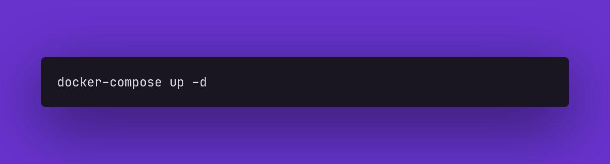
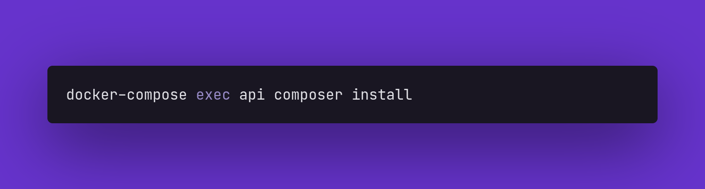
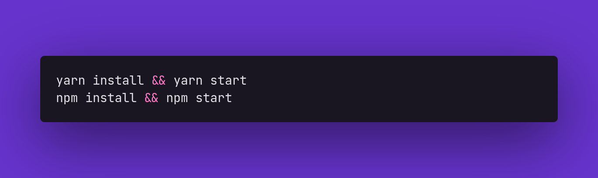

<h4 align="center">
 
</h4>

  
  
  
  

 

## Instalação

__Requisitos__: docker com docker-compose, node (npm ou yarn)

 

### Backend

Execute o comando na pasta __backend__ para iniciar o docker:

 

Iniciado o contêiner, execute o comando para instalar as dependências e bibliotecas utilizadas por meio do composer:

 

Após seguidos os passos acima no diretório __backend__ do projeto, você poderá acessar a __API__ na url: [localhost:8000](http://localhost:8000)

 

### Frontend

Agora vamos iniciar a parte visual do projeto, volte no __diretório raíz__ do projeto e entre no diretório __frontend__ e execute o comando abaixo de acordo com seu gerenciador de pacotes node:

 

__P.S.:__ Se o node não abrir automaticamente em seu navegador padrão a página do projeto em React, acesse o link: [localhost:3000](http://localhost:3000)

 
 
 

---

Feito com ❤️ por <strong>Matheus do Carmo</strong>

