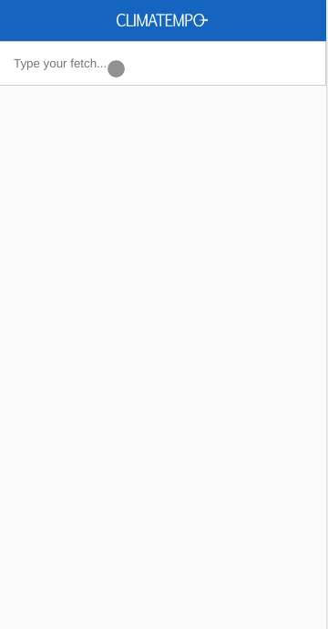
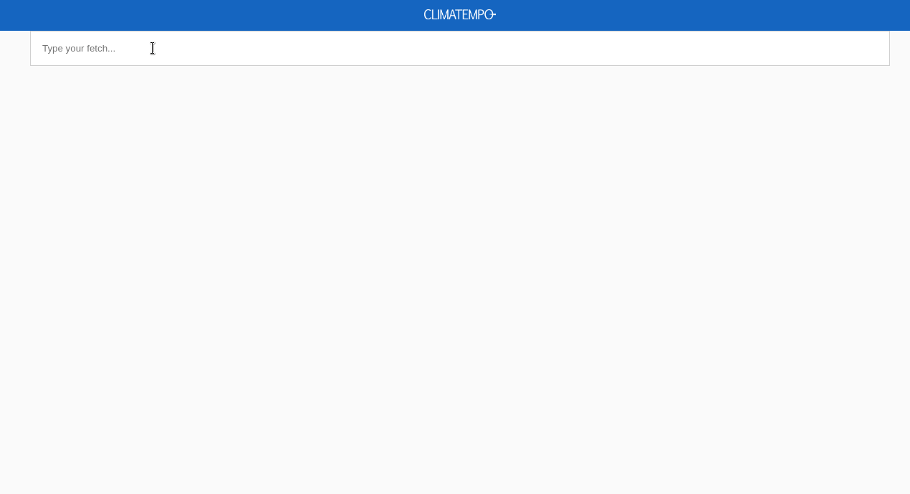

  

## Uma Aplicação para buscar a privisão do tempo da cidade de São Paulo e Osasco

### Usando:

- Webpack 4+ e Webpack Dashboard para configuração de toda a aplicação, separando por bundle de desenvolvimento e produção
- Babel para transpilar
- HTML e CSS gerado automaticamente e minimizado e otimizado para produção
- React 16+ com Hooks
- Redux e Redux Thunk com Hooks
- Pré-processador Sass
- Eslint (Airbnb)
- Prettier
- Husky com `pre-commit`
- Teste de interface com Cypress

## Dependência:

- Node.js `>=` v12.16.1;

## Para executar

- Clone este repositório: `git clone git@github.com:luanribeiros/fetch-weather-forecast.git`;
- Remova `.git` directory;
- Instale as dependências: `yarn` (ou `npm install`);
- Execute `yarn` (ou `npm start`) para a porta`http://localhost:3000`
- Execute `yarn build` (ou `npm run build`) para build de produção (todos os arquivos vão para o diretório `build-prod`)

## Executar testes

- Execute `yarn run test` ou `npm run test` e irá abrir a janela de testes do cypress

