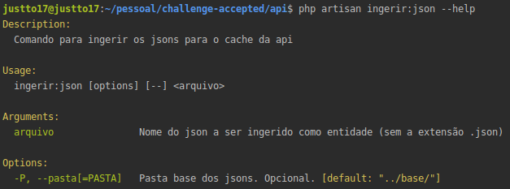
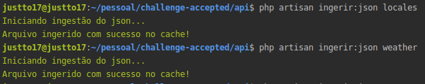

  

___

## API

Esta é uma API para listagem de previsões de determinadas localizações. Para o desenvolvimento, foram utilizadas as seguintes tecnologias:
 - [PHP 7.2](https://www.php.net/archive/2019.php#2019-08-29-2)
 - [Laravel 5.8](https://laravel.com/docs/5.8/releases)
 - [Composer](https://getcomposer.org/)

As dependências detalhadas do projeto podem ser encontradas no [composer.json](composer.json).

### Como foi feito?

Visando performance, utilizei o [cache](https://laravel.com/docs/5.8/cache) do Laravel para consulta rápida dos _jsons_, assim descartando a implementação de uma camada Model e dispensando a necessidade de usar um banco de dados. 

Para aproveitar os dados da pasta [base](../base), utilizei o recurso de [comandos](https://laravel.com/docs/5.8/artisan#generating-commands) do Laravel e criei um comando para ingerir os _jsons_ no cache da aplicação. A utilização é bem simples:

> php artisan ingerir:json {nomedoarquivo} --pasta={pasta | opcional}

Tal implementação do comando suportaria futuros dados podendo ser extendida para mais _jsons_. 

Na camada de dados, decidi centralizar a interação dos objetos **locale** e **weather** em Repositories, pois, se um dia houvesse a necessidade de utilizar um banco, apenas a camada de repositório seria alterada.

Foram criados um repositório para cada "entidade" (representada pelo _json_ cacheado), sendo [LocaleRepository](app/Repository/LocaleRepository.php) e [WeatherRepository]((app/Repository/WeatherRepository.php)). Prezando o reuso, criei o repositório abstrato [AbstractRepository](app/Repository/AbstractRepository.php) em que ambos os repositórios são herdados.

Referente a camada de [Controllers](app/Http/Controllers), organizei as endpoints da seguinte maneira:

- `/api/locales` Lista as localizações.
- `/api/locales/{id}/weather` Lista as previsões de uma determinada localização.

Para facilitar, criei uma [collection do Postman](../Climatempo%20API.postman_collection.json) para testes.

#### Testes

Foram criados testes funcionais para as endpoints da API. Ambas estão estão na classe [ApiTest](tests/Feature/ApiTest.php). Eles podem ser testados através do [PHPUnit](https://phpunit.de/). 

### Como instalar?

Considerando que PHP e Composer estão instalados, execute o comando para instalar as dependências da API (Laravel incluido): `composer install` 

### Como rodar?

Antes de rodar, é necessário ingerir os jsons no cache da API:
- `php artisan ingerir:json locales`
- `php artisan ingerir:json weather`

Após sucesso, execute o comando `php artisan serve`. A porta padrão utilizada é **8000**, podendo ser alterada passando a opção `--port` no comando.
 
> Exemplo: `php artisan serve --port=8080`. 

Para mais informações, consulte: https://laravel.com/docs/5.8

### Screenshots

    <small>Informações comando criado</small>
    

    <small>Execução dos comandos de ingerir</small>
    

    <small>Requisição de localizações</small>
    

    <small>Requisição de previsões de uma localização</small>
    

