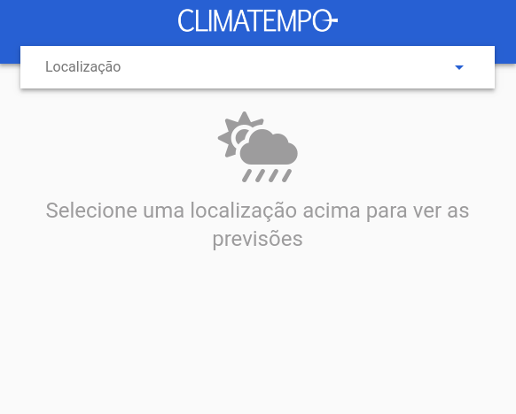
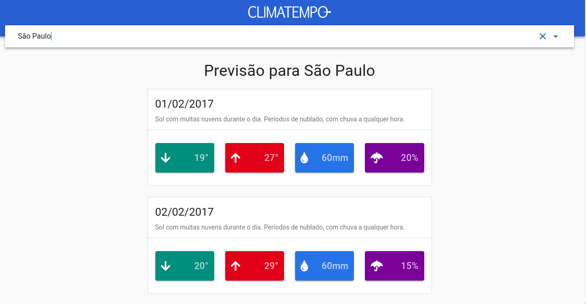
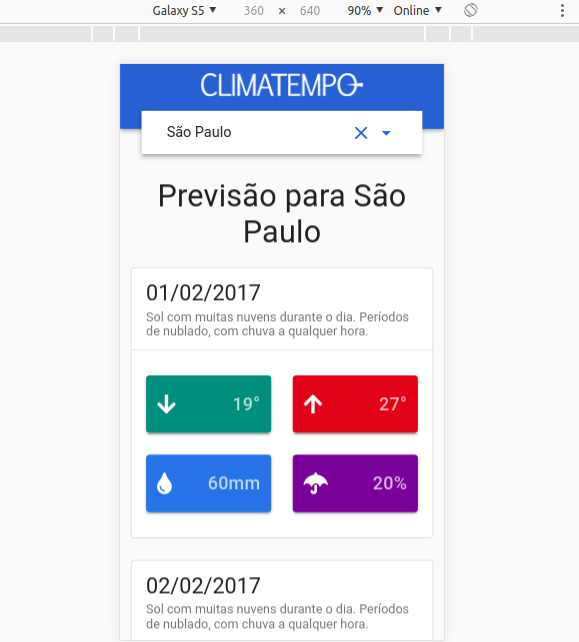
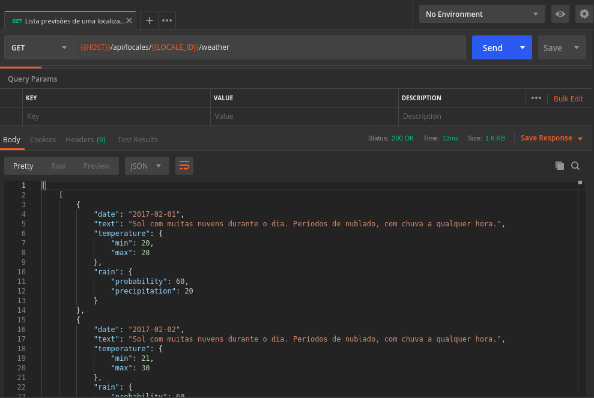

  

___

## Web

Esta é uma aplicação web para listagem de previsões de determinadas localizações. Para o desenvolvimento, foram utilizadas as seguintes tecnologias:
 - [NodeJS 10.13](https://nodejs.org/en/download/)
 - [NPM](https://www.npmjs.com/)
 - [VueJS](https://vuejs.org/)

As dependências detalhadas do projeto podem ser encontradas no [package.json](package.json).

### Como foi feito?

Para a parte visual, utilizei a UX/UI do módulo [VuetifyJS](https://vuetifyjs.com/en/), que é inspirado no Material Design. Criei o componente [Weather](src/components/Weather.vue) para representar o card da previsão. O restante está implementado no componente padrão [App](src/App.vue).

Na camada de dados, utilizei o recurso [Vuex](https://vuex.vuejs.org/) do VueJS, que implementa o conceito de [Redux](https://redux.js.org/), o que possibilitaria o reuso dos objetos no _store_ da aplicação por múltiplos componentes, sem perda significativa de performance. Desta forma, criei _stores_ para as "entidades" [locale](src/store/locale) e [weather](src/store/weather).   

Para chamadas HTTP utilizei o [Axios](https://github.com/axios/axios), encapsulado nas _actions_ dos _stores_.

### Como instalar?

Considerando que Node e NPM estão instalados, execute o comando para instalar as dependências da aplicação (VueJS incluido): `npm install` 

### Como rodar?

Execute o comando `npm run serve`. A porta padrão utilizada é **8080**. 

Para mais informações, consulte: https://www.npmjs.com/package/serve

### Screenshots

    <small>Página inicial</small>
     
    

    <small>Página de previsões</small>
     
    

    <small>Página de previsões (mobile)</small>
     
    

    <small>Requisição de previsões de uma localização</small>
     
    

